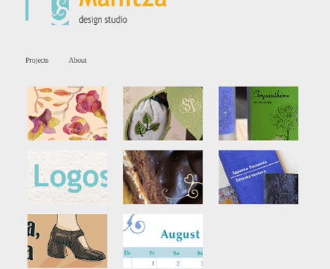

THIS PROJECT IS DEAD.  THE CODE IS KEPT HERE ONLY FOR HISTORIC PURPOSES.

javascript experiment :) 

Hints. To change design on fly, type on html document: 
  - printux
  - developer
  - designer
  
You can change content in such way.

The code is made 2009 and is out of date.
It is easy to replace view or change model and create another presentation site, but I not recommend to waste your time. 

Pictures and logos are copyright of Elena Kalpakchieva. Code is free for everybody. 

